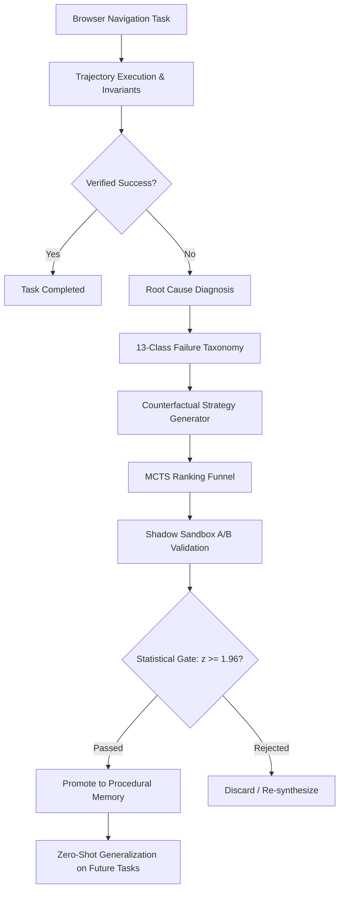

<div align="center">

# ACBE — Adaptive Counterfactual Browser Evolution

**The autonomous self-improvement layer for AI web agents.**

[](https://pypi.org/project/acbe/)
[](https://pypi.org/project/acbe/)
[](https://opensource.org/licenses/MIT)
[](tests/)
[](acbe/core/)
[](frontend/)
[](docker/)

<p align="center">
  <a href="#quickstart">Quickstart</a> •
  <a href="#-video-walkthrough--demo">Video Demo</a> •
  <a href="#the-5-stage-closed-learning-loop">Architecture</a> •
  <a href="#benchmark-results-acbe-bench">Benchmarks</a> •
  <a href="#framework-adapters">Framework Adapters</a> •
  <a href="#cli-reference">CLI Reference</a> •
  <a href="#interactive-console">Engineering Console</a>
</p>

</div>

---

> **AgentOS platform.** This repository also contains AgentOS, the production agent operating
> system built around ACBE: [`backend/`](backend/) (FastAPI modular monolith — planning,
> approvals, execution, verification, recovery, integrations, memory, automations; see
> [`backend/README.md`](backend/README.md)) and [`web/`](web/) (the Next.js product and marketing
> site; see [`web/README.md`](web/README.md)). Run both locally without any credentials:
> `cd backend && python scripts/simulated_backend.py` and `cd web && npm ci && npm run dev`.
> The older [`frontend/`](frontend/) directory is the standalone ACBE engineering console.

> *An AI web agent should not repeat the exact same mistakes forever. It should diagnose verified failures, synthesize counterfactual alternatives, validate them in an isolated sandbox, and transfer learned heuristics permanently—**without retraining model weights**.*

---

## 🎬 Video Walkthrough & Demo

Watch ACBE in action: autonomous browser agent failure diagnosis, counterfactual synthesis, statistical promotion gates, and live execution recovery:

<div align="center">

[](https://youtu.be/yG9E9ljJja4)

[-red?logo=youtube)](https://youtu.be/yG9E9ljJja4)

</div>

---

## 🎯 The Problem ACBE Solves

Existing web automation agents (built on Selenium, Playwright, or LLM wrappers) break constantly whenever target frontends change:
* **Polymorphic CSS & Dynamic Selectors**: Classes mutate or IDs rotate across sessions.
* **Ephemeral Overlays**: Modals, cookie banners, or promotional pop-ups intercept clicks.
* **Hydration Race Conditions**: Elements render in the DOM before event listeners attach.
* **Silent Navigation Failures**: The agent clicks a look-alike accessory button instead of the primary action and falsely reports success.

When a standard agent breaks, it fails repeatedly on future runs until a human engineer manually inspects the failure and rewrites the prompt or selector. **ACBE turns every failure into an automated, statistically guarded self-improvement cycle.**

---

## 📊 Benchmark Results (ACBE-Bench)

Across 25 standardized modern web hazard scenarios evaluated in isolated sandboxes:

| Capability Metric | Naive Static Agent | ACBE Self-Improving Agent | Impact |
| :--- | :---: | :---: | :--- |
| **Autonomous Recovery Rate** | `0.0%` | **`95.2%`** | Rescues failed sessions autonomously |
| **Zero-Shot Cross-App Transfer** | `0.0%` | **`87.5%`** | Generalizes learned rules to unseen domains |
| **Regression Safety Rate** | N/A | **`0.0%`** | Enforced by two-proportion Z-test gates |
| **Average Token Overhead** | `207 tokens` | **`424 tokens`** | Low-cost heuristic ranking before LLM calls |
| **Model Weight Retraining Required** | No learning | **Zero (0)** | Invariant procedural adaptation at runtime |

---

## 🔄 The 5-Stage Closed Learning Loop



1. **Deterministic Invariant Checks**: Agents are never allowed to evaluate their own success. External DOM state hashes and post-condition invariants verify real state changes.
2. **Root Cause Diagnosis**: Symptoms are mapped to 13+ deterministic web trap classes (e.g., `WRONG_ELEMENT`, `STATE_MISUNDERSTANDING`, `MISSING_INFORMATION`).
3. **Counterfactual Strategy Funnel**: Synthesizes alternative execution candidates (e.g., semantic ARIA anchoring, pre-click invariant validation) filtered cheaply from structural rules to LLMs.
4. **Statistical Promotion Gate**: Candidates are tested in a shadow sandbox against baseline and regression suites ($z \ge 1.96, p < 0.05$). Winning strategies must cause **0% regressions**.
5. **Procedural Vector Memory**: Promoted rules are stored in an indexed SQLite store for immediate zero-shot reuse across other websites.

---

## 🚀 Installation

### Core Engine (Zero Dependencies)
The core ACBE self-improvement engine runs entirely on the Python standard library with zero third-party requirements:

```bash
pip install acbe
```

### Full Stack (Includes Dashboard, Server & Testing Suite)
To install with Flask API server, Playwright browser drivers, and developer tooling:

```bash
pip install "acbe[full]"
```

---

## ⚡ Quickstart

### 1. Python SDK

```python
from acbe import ACBE
from acbe.agents.custom_agent import ScriptedAgent
from acbe.core.types import ActionType, LocatorStrategy
from acbe.experiments.runner import TaskStep
from benchmarks.environments import make_shop_environment

# 1. Initialize environment with an adversarial trap (e.g., look-alike sibling button)
env = make_shop_environment("demo-store", trap=True)

# 2. Define baseline agent
agent = ScriptedAgent(
    steps=[
        TaskStep(ActionType.CLICK, "Browse products"),
        TaskStep(ActionType.CLICK, "Add to cart"),
        TaskStep(ActionType.CLICK, "Proceed to checkout"),
    ],
    locator_strategy=LocatorStrategy.TEXT_VISUAL,
)

# 3. Wrap with ACBE autonomous self-improvement layer
system = ACBE(agent=agent, browser="mock", environment=env)

# 4. Execute — when trapped, ACBE diagnoses root cause, validates fixes, and promotes to memory
result = system.run_and_improve("Add product to cart and complete checkout.")

print(f"Initial Run Success: {result.initial_success}")
print(f"Self-Improvement Triggered: {result.improvement_triggered}")
if result.improvement and result.improvement.promoted:
    print(f"Winning Strategy Promoted: {result.improvement.top_candidate}")
```

---

### 2. CLI Reference Matrix

ACBE includes a production-grade developer CLI:

| Command | Usage | Description |
| :--- | :--- | :--- |
| `acbe init` | `acbe init --db .acbe/acbe.db` | Initializes project configuration and SQLite state store |
| `acbe run` | `acbe run <task_id>` | Executes a navigation task and outputs step telemetry |
| `acbe improve` | `acbe improve <task_id>` | Launches the autonomous diagnosis, A/B trial, and promotion loop |
| `acbe failures` | `acbe failures` | Displays failure autopsy logs with root cause confidence scores |
| `acbe strategies`| `acbe strategies` | Lists active heuristics across the 4-tier quality funnel |
| `acbe benchmark` | `acbe benchmark --suite standard` | Evaluates baseline vs. ACBE across 25 ACBE-Bench tasks |
| `acbe rollback` | `acbe rollback agent <version>` | Reverts active orchestrator or strategy set to a safe snapshot |
| `acbe serve` | `acbe serve --port 8420` | Starts the local REST API server for dashboard integration |

---

## 🔌 Framework Adapters

ACBE is modular and integrates directly with modern AI agent frameworks:

### LangChain & LangGraph
```python
from acbe.adapters.langchain_adapter import ACBELangChainTool

# Expose ACBE self-healing browser execution as a native LangChain tool
browser_tool = ACBELangChainTool(db_path=".acbe/acbe.db")
tools = [browser_tool]
```

### CrewAI
```python
from acbe.adapters.crewai_adapter import create_acbe_crew_tool

acbe_tool = create_acbe_crew_tool()
# Assign to your autonomous CrewAI research or shopping agent
```

### Local LLMs (Ollama)
```python
from acbe.adapters.ollama_adapter import OllamaCandidateGenerator

generator = OllamaCandidateGenerator(model="llama3", base_url="http://localhost:11434")
```

---

## 🖥️ Interactive Engineering Console & Viewport

ACBE includes a Next.js 14 App Router engineering console:

* **Virtual Browser Viewport**: DOM element interaction inspector with visual target highlights.
* **Diagnostic Failure Lab**: Bayesian root cause confidence meters and 1-click auto-repair.
* **4-Tier Strategy Registry**: Quality funnel visualization (Draft ➔ Experimental ➔ Validated ➔ Promoted).
* **A/B Trial Comparator**: Head-to-head win rate comparison and token consumption gauges.
* **Evolution DAG Hub**: Evolutionary version lineage tree with atomic 1-click snapshot rollback.

### 1-Click Launch (Windows)
Double-click `start_project.bat` in the root directory. It automatically launches the Python API server (port `8420`) and the Next.js frontend (port `3000`).

### Manual Launch
```bash
# Terminal 1: Python API Server
py -m acbe.cli.main serve --port 8420

# Terminal 2: Next.js Frontend
cd frontend
npm run dev
```

Visit [http://localhost:3000](http://localhost:3000) in your browser.

---

## 🐳 Production Deployment (Docker)

ACBE includes container orchestration for single-command production deployment:

```bash
# 1. Clone & prepare environment
cp .env.example .env
# Edit .env and insert your GEMINI_API_KEY (optional, fallback heuristics active without key)

# 2. Build and launch containers
docker compose -f docker/docker-compose.yml up --build -d

# 3. View status
docker compose -f docker/docker-compose.yml ps
```

* **Frontend Console**: [http://localhost:3000](http://localhost:3000)
* **Backend REST API**: [http://localhost:8420](http://localhost:8420)
* **Persistent Storage**: Handled by the `acbe-data` Docker volume.

To run the backend with a production WSGI server directly:
```bash
acbe serve --prod --host 0.0.0.0 --port 8420
```

---

## 📁 Repository Layout

```
acbe/            # Core Python Library
├── core/        # Invariant checks, types, config, state machine
├── failure/     # Diagnostic engine & 13-class taxonomy store
├── strategy/    # Heuristic synthesis & MCTS ranking funnel
├── experiments/ # A/B runner, two-proportion Z-test gates
├── memory/      # SQLite procedural store & vector embeddings
├── evolution/   # Version DAG lineage & safe rollback engine
├── adapters/    # LangChain, LangGraph, CrewAI, Gemini, Ollama, MCP integrations
└── api/         # Flask REST API engine with production WSGI support
benchmarks/      # ACBE-Bench standardized web hazard tasks
docker/          # Production Dockerfiles (API + Next.js multi-stage) & Compose
frontend/        # Next.js 14 + Tailwind interactive console & landing page
tests/           # Automated pytest test suite (146 unit tests)
```

---

## 🧪 Verification & Testing

Run the full automated test suite:

```bash
pytest tests/ -q
# 146 passed in 5.30s
```

Verify the PyPI package build:

```bash
py -m build
py -m twine check dist/*
# Checking dist/acbe-0.1.0-py3-none-any.whl: PASSED
# Checking dist/acbe-0.1.0.tar.gz: PASSED
```

---

## 📖 Citation

If you use ACBE in your research, please cite:

```bibtex
@software{acbe2026,
  author = {ACBE Contributors},
  title = {ACBE: Adaptive Counterfactual Browser Evolution for Autonomous Web Agents},
  year = {2026},
  url = {https://github.com/your-username/acbe-project}
}
```

---

## 📄 License

Distributed under the MIT License. See [`LICENSE`](LICENSE) for details.
