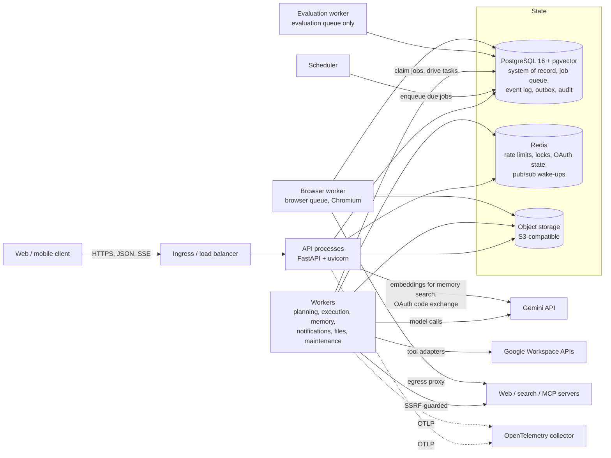
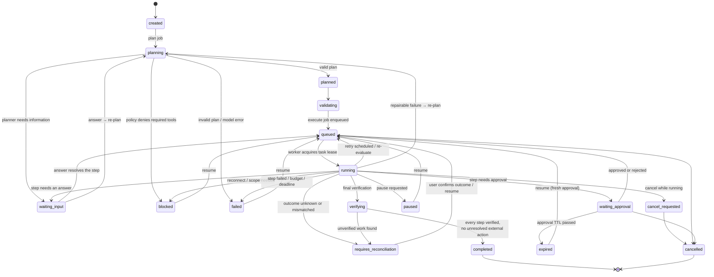
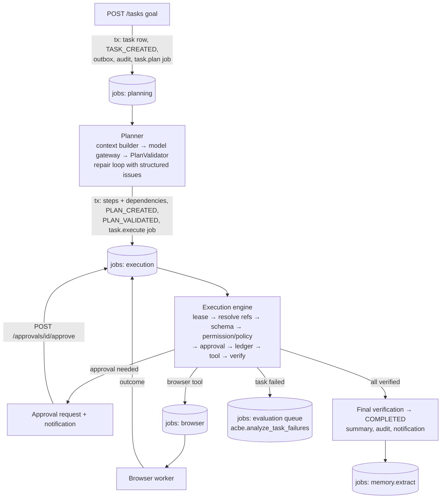

# AgentOS architecture

AgentOS is an action-taking, tool-using, self-verifying agent platform. Its core rule:

> **LLM proposes. Backend decides. Tools execute. Verifier confirms.**

The model only ever *proposes* a plan (structured JSON). Deterministic backend code
validates it, decides permissions and approvals, executes tools through owned adapters,
verifies every effect against the external system and reports only what was verified.

The backend is a **modular monolith with durable workers**: one codebase and one image,
several process types, PostgreSQL as the single system of record.

## Process topology



| Process | Entry point | Scales | Notes |
|---|---|---|---|
| API | `uvicorn --factory app.main:app_factory` | horizontally (stateless) | request/response, SSE streams, never runs long work |
| Worker | `agentos-worker --queues planning,execution,memory,notifications,files,maintenance` (`app.workers.worker`) | horizontally | claims jobs under leases; any worker can resume any task |
| Evaluation worker | `agentos-worker --queues evaluation` | 0–1 (optional) | the only consumer of the `evaluation` queue: evaluation runs, ACBE failure analysis and experiments (the harness swaps process singletons, so it must serve that queue alone) |
| Browser worker | `agentos-browser-worker` (`app.browser.worker`) | horizontally, isolated | only process that runs Chromium; own image and network policy |
| Scheduler | `agentos-scheduler` (`app.workers.scheduler.scheduler`) | 1 (2 is safe) | turns time into jobs; dedupe keys make duplicates harmless |
| Migrations | `alembic upgrade head && python -m app.cli sync-tools` | one-shot | never run by application startup; `sync-tools` mirrors the built-in tool specs into `tool_definitions`/`tool_versions` |

## Module map

Every domain module lives in `app/<module>/` and owns its `models.py`, `schemas.py`,
`service.py`, `router.py` (and optionally `tools.py`, `jobs.py`). Other modules call its
`service.py`, never its router or (where a service exists) its tables.

| Module | Responsibility |
|---|---|
| `core` | settings (`config.py`), database engine + **tenant guard**, Redis, logging, metrics, tracing, middleware, crypto (`KeyManager`), typed exceptions |
| `api` | router composition, dependencies (auth context, RBAC, rate limits), error envelope, health probes |
| `auth` | registration, login, refresh rotation with reuse detection, sessions, TOTP MFA, stream tokens, Google sign-in |
| `users`, `organizations` | profiles, account deletion, organizations (tenants), members, roles, **organization policy** |
| `agents` | agents and immutable agent versions (instructions, model/tool/memory policies, limits) |
| `tasks` | task/step models, **state machines** (`state.py`), task API incl. SSE, cancel/pause/resume/input/confirm |
| `planner` | context builder (`context.py`), planner service, **plan validator** |
| `permissions` | pure permission/policy engine: `ALLOW` / `REQUIRE_APPROVAL` / `DENY` with reasons |
| `approvals` | durable, action-bound, expiring, single-use approvals |
| `execution` | **execution engine**, argument references (`$ref` / templates), user-facing summary |
| `verification`, `recovery` | verification records; failure classifier + recovery planner |
| `tools` | tool interface (`base.py`), registry/resolver, built-in tools (Gmail, Calendar, Drive, Contacts, compute), tool policy rules |
| `integrations` | Google OAuth connections, credential vault (encrypted tokens), signed inbound webhooks |
| `mcp` | MCP gateway: server registry, tool discovery with rug-pull protection, policy checks, adapter |
| `browser` | browser tools, isolated executor, egress proxy, browser worker |
| `memory` | multi-layer memory, hybrid retrieval (keyword + pgvector), freshness, conflicts, extraction |
| `files`, `search` | uploads with scanning/processing, object storage; web and document search |
| `model_gateway` | the only path to LLMs: tiers, retries, fallbacks, structured output, cost accounting |
| `automations` | cron-scheduled task templates materialized by the scheduler |
| `notifications`, `audit`, `usage`, `billing`, `admin` | in-app/e-mail notifications, append-only audit log, metering, plans/entitlements, platform administration |
| `acbe`, `evaluation` | controlled self-improvement (see [acbe.md](acbe.md)); evaluation harness, suites and CLI |
| `workers` | queue abstraction + PostgreSQL implementation, worker process, scheduler, maintenance jobs |
| `common` | IDs (UUIDv7), events/outbox, idempotency, pagination, redaction, sanitization, feature flags |

The root `acbe/` library (installed alongside the backend) provides reusable evaluation and
promotion statistics used by `app.acbe`.

## Request lifecycle

```mermaid
sequenceDiagram
    autonumber
    participant C as Client
    participant M as Middleware
    participant D as Dependencies
    participant H as Handler / service
    participant PG as PostgreSQL
    participant R as Redis

    C->>M: HTTP request
    M->>M: RequestContext (X-Request-ID, span, metrics, access log)<br/>SecurityHeaders · TrustedHost · CORS · BodySizeLimit
    M->>D: route matched
    D->>R: per-IP sliding-window limit (Lua, one round trip)
    D->>PG: verify JWT → load session row → active membership → role permissions
    D->>D: build RequestContext; scope DB session to tenant_id
    D->>R: per-user and per-tenant limits (+ route limits)
    D->>H: RBAC check (require(P.X))
    H->>PG: one transaction: state change + audit row + task event + outbox + job
    PG-->>H: commit
    H-->>C: response (or error envelope with request_id)
```

* Middleware is pure ASGI (safe for streaming). Order, outermost first: request context,
  security headers, trusted host, CORS, body-size limit.
* The tenant is **never** taken from the client: it comes from the verified session.
  From the moment the context is built, every ORM query on that DB session is filtered by
  `tenant_id` (see [security.md](security.md#tenant-isolation)).
* Handlers never hold a transaction open across network I/O: *persist intent → commit →
  call external → persist outcome*.
* Work that takes longer than a request is **enqueued in the same transaction** as the
  state change that needs it, so a job exists if and only if that change committed.

## Durable queue, outbox and events

* **Jobs** live in the `jobs` table. Workers claim with `SELECT … FOR UPDATE SKIP LOCKED`,
  hold a time-bounded lease they heartbeat, and `complete` / `fail` / `release` the job.
  Retries use exponential backoff with jitter; jobs that exhaust `JOB_MAX_ATTEMPTS` are
  **dead-lettered** (`status = dead`) and visible under `GET /admin/jobs/dead`. A crashed
  worker's lease simply expires and `recover_expired_leases` makes the job claimable again.
* **Dedupe keys** coalesce duplicates: `task:<id>` for execution, `plan:<id>` for planning,
  time-bucketed keys for periodic maintenance jobs.
* **Task events** (`task_events`) are the immutable, per-task, gap-free ordered log
  (`seq` 1, 2, 3 …) written in the same transaction as each state change. They power
  `GET /tasks/{id}/events` and the SSE stream.
* **Outbox**: each event also writes an `outbox_events` row; a relay inside every worker
  publishes them to Redis pub/sub (`agentos:task:<id>`, `agentos:user:<id>`). Pub/sub is only
  a *wake-up hint* — SSE readers always re-read durable events from PostgreSQL, so lost or
  duplicated messages cannot corrupt what clients see.

## Task lifecycle

Only the transitions in `app/tasks/state.py` are legal; anything else raises
`InvalidStateTransition`. Terminal states are `completed` and `cancelled`; `failed`,
`expired`, `blocked`, `paused` and `requires_reconciliation` are *resting* states a user
action can resume.



Steps have their own state machine (`pending → running → verifying → completed`, plus
`waiting_approval`, `waiting_input`, `waiting_external` (browser), `retry_scheduled`,
`requires_reconciliation`, `blocked`, `failed`, `skipped`, `cancelled`). A step is
`completed` only after its verifier returns machine-readable **PASSED** evidence. Details:
[agent-execution.md](agent-execution.md).

## Data flow of one task



## Data model (main tables)

| Area | Tables |
|---|---|
| Identity & tenancy | `users`, `user_identities`, `auth_sessions`, `refresh_tokens`, `mfa_factors`, `organizations`, `organization_members`, `roles`, `permissions`, `role_permissions` |
| Agents & tasks | `agents`, `agent_versions`, `agent_configs`, `tasks`, `task_steps`, `task_dependencies`, `task_events`, `task_attempts`, `execution_logs`, `external_actions` (idempotency ledger), `verification_results`, `failure_records`, `recovery_attempts` |
| Approvals & policy | `approval_requests`, `approval_actions`, `tool_permissions`, organization `policy` (JSONB, versioned), `feature_flags` |
| Integrations & tools | `oauth_connections`, `oauth_scopes`, `tool_credentials`, `tool_definitions`, `tool_versions`, `mcp_servers`, `mcp_tools`, `webhook_deliveries` |
| Browser | `browser_tasks`, `browser_sessions` |
| Memory, files, search | `memory_items`, `memory_embeddings` (pgvector), `memory_sources`, `files`, `file_metadata`, `search_documents`, `search_chunks` |
| Automations | `automations`, `automation_runs` |
| Platform | `jobs`, `outbox_events`, `worker_heartbeats`, `api_idempotency_keys`, `audit_logs` (append-only), `usage_events`, `usage_aggregates`, `billing_accounts`, `subscriptions`, `notifications` |
| Learning & evaluation | `strategy_candidates`, `strategy_experiments`, `strategy_results`, `evaluation_runs`, `evaluation_results`, `experiments` |

All identifiers are UUIDv7 (time-ordered, index friendly). Tenant-owned tables carry
`tenant_id` via `TenantScopedMixin`. Schema changes happen **only** through Alembic
migrations in `migrations/versions/`.

## Why this shape

* **One system of record.** Tasks, steps, events, jobs, approvals and the idempotency ledger
  are in PostgreSQL, so every state change and the work it requires commit atomically, and
  any worker can resume any task after a crash.
* **Stateless compute.** API and worker processes hold no durable state; they scale out
  and can be killed at any time (leases expire, work resumes, side effects are reconciled).
* **Replaceable edges.** The queue (`JobQueue` protocol), event bus (`EventBus`), vector
  index (`VectorIndex`), key manager (`KeyManager`), model providers and object storage
  sit behind small interfaces so Kafka/PubSub, a dedicated vector store or a cloud KMS can
  replace the defaults without touching domain code.

See [deployment.md](deployment.md) for scaling, partitioning and multi-region evolution.
